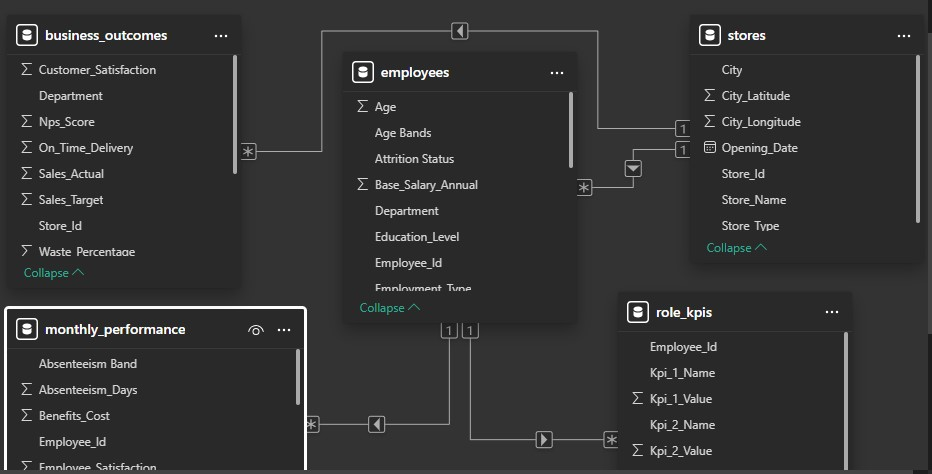
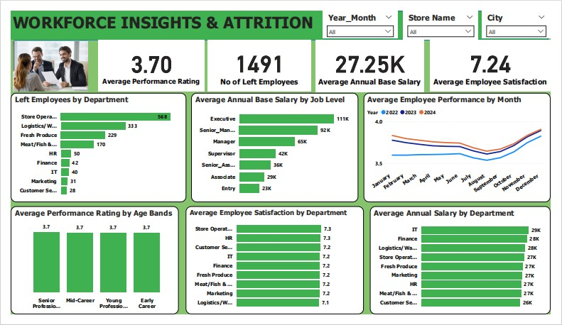
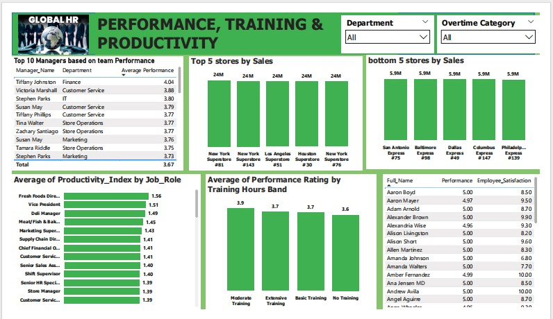

# Employee-Performance-Analytics-Capstone-Project

## 🎓 Capstone Project by Christopher Stanley  
**Learning Center:** Codeant Technology Hub  
**Instructor:** Mr Jodans  
**Tool Used:** Microsoft Power BI  

## 📘 Project Overview
The **Employee Performance Analytics** project aims to uncover key workforce insights from a comprehensive HR dataset spanning **2022–2024**.  
The goal is to understand how factors such as **performance, salary, training, and employee satisfaction** influence overall productivity and retention.  

The project was completed as part of the **Codeant Technology Hub Capstone Program**, focusing on using **Power BI** to build data-driven HR dashboards that support strategic decision-making.

## ⚙️ Project Workflow

### 1️⃣ Data Collection & Understanding
- Dataset obtained from Codeant Technology Hub for the Capstone project.  
- Data includes employee demographics, compensation, training hours, performance ratings, and store-level sales.

### 2️⃣ Data Cleaning (Power Query)
- Removed duplicates and null values.  
- Renamed inconsistent headers and standardized data types.  
- Created new grouped columns for better analysis:  
  - `Attrition_Status` → Active / Left  
  - `Age_Band` → Early Career, Young Professional, Mid-Career, Senior Professional  
  - `Training_Hours_Band` → No Training, Basic, Moderate, Extensive  
  - `Absenteeism_Band` → No Absence, Low, Moderate, High  
  - `Salary_Band` → Entry, Associate, Manager, Senior, Executive  

### 3️⃣ Data Modeling

- Created relationships between:
  - Employee table, Performance table, Store table, and Department table.  
- Built a star schema model with unique identifiers (`Employee_ID`, `Manager_ID`, `Store_ID`).  

### 4️⃣ Data Visualization (Power BI)
Two dashboard pages were developed to communicate key HR insights:

#### 🔹 Workforce Insights & Attrition

- Shows organization-wide metrics on employee turnover, satisfaction, and salary by level.  
- Highlights attrition by department and performance trends over time.  

#### 🔹 Performance, Training & Productivity

- Analyzes manager and store-level performance.  
- Evaluates training impact, job-role productivity, and promotion readiness.  

## 📊 Key Insights

### Workforce Insights & Attrition
- **Average Performance Rating:** 3.70  
- **Employees Who Left:** 1,491  
- **Average Annual Salary:** 27.25K  
- **Average Employee Satisfaction:** 7.24  
- **Store Operations (568)** and **Logistics/Warehousing (333)** recorded the highest attrition.  
- **Salary Distribution:** Executive 111K → Entry 23K; IT and Finance lead with the highest average pay.  
- **Performance Trend:** Mid-year dip with peak in November–December.  
- **Satisfaction:** Steady (7.1–7.3) but lowest in Logistics/Warehousing.

### Performance, Training & Productivity
- **Top Managers by Team Performance:** Tiffany Johnston (Finance) – 4.04, Victoria Marshall (Customer Service) – 3.88.  
- **Top 5 Stores by Sales:** New York, Los Angeles, and Houston Superstores (≈24M each).  
- **Bottom 5 Stores by Sales:** San Antonio, Baltimore, Dallas, Columbus, and Philadelphia Express (≈5.9M).  
- **Training Effect:** Moderate training (3.9) outperforms no training (3.6).  
- **Productivity by Role:** Fresh Foods Director (1.56) and Vice President (1.51) highest; Customer Service and Store Managers lowest.  
- **Promotion Readiness:** High-performing employees (e.g., Aaron Boyd, Amber Fernandez) show strong satisfaction (8.5–10), making them ideal promotion candidates.

## 💡 Recommendations

- Strengthen **retention and engagement** initiatives in high-attrition departments such as Store Operations and Logistics.  
- Review **salary equity** for entry-level and frontline positions to improve motivation.  
- Introduce **mid-year refresher training** to maintain performance consistency.  
- Scale leadership practices from **top-performing managers** to other teams.  
- Replicate **operational strategies** from top-performing stores to boost weaker branches.  
- Maintain **moderate training cycles** to sustain performance improvement.  
- Establish a **data-driven promotion pipeline** to retain high performers.  

## 🧠 Key Takeaways
This project demonstrates the power of **data analytics in Human Resource Management**.  
By analyzing employee behavior, performance, and compensation trends, HR leaders can design better retention strategies, optimize training investments, and enhance workforce productivity.

## 🏁 Conclusion
.jpeg)

The **Employee Performance Analytics Dashboard** provides clear visibility into the organization’s workforce dynamics.  
Findings show that attrition is largely driven by pay gaps, workload, and engagement levels in frontline roles.  
Training, fair compensation, and strong leadership remain the most effective levers for improving employee satisfaction and performance.

## 🙏 Acknowledgment
This Capstone project was completed at **Codeant Technology Hub** under the mentorship of **Instructor  Mr Jodans**.  
Their guidance was instrumental in building both the analytical and visualization aspects of this project, from data modeling to storytelling with Power BI.

## 🏷️ Tags
`#HRAnalytics` `#EmployeePerformance` `#PowerBI` `#DataAnalytics` `#CodeantTechHub` `#CapstoneProject` `#Jodans` `#DataStorytelling`
